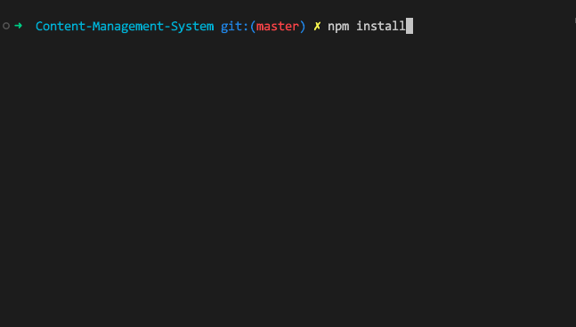
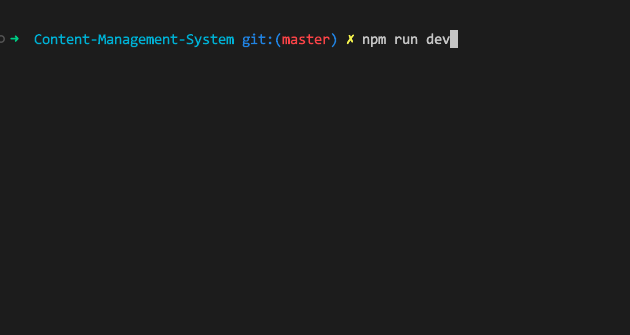
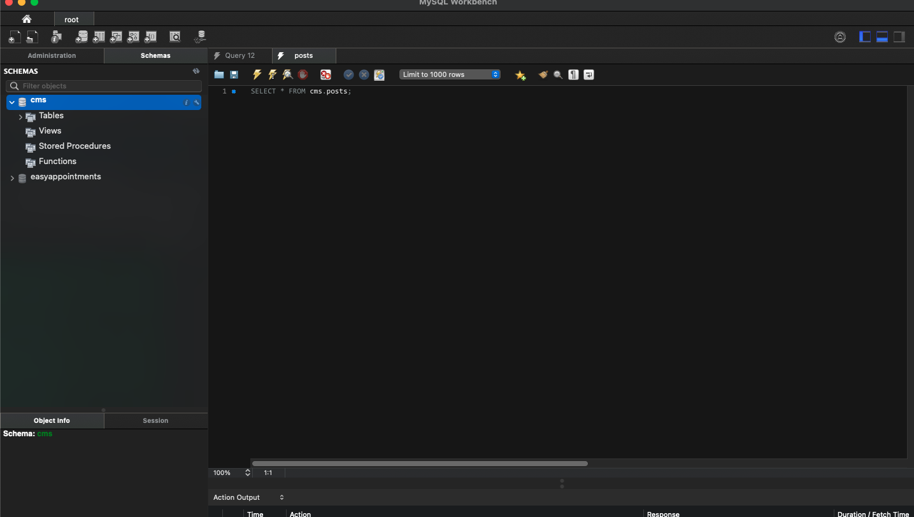

# Content Management System
#### Project Description
This is a content management system that I have built using ExpressJS which is a backend framework for Javascript that is connected to a MySQL database. Your able to create your own user and manage the content to allow multiple contributers to create, edit and publish content. The content is stored in a database and displayed in a presentation layer based on a set of templates like a website.

#### Install and Run the Project
```
run your local server
import .sql file into your database
go into the terminal and type: 
npm install (to install the node_modules folder that contains the packages) 
npm run dev: runs the server
```

#### How to use the Project
Go into the terminal and type: npm install


Go into the terminal and type: npm run dev (to run the server)


Import the cms.sql file into your database manager


#### Credits
I have to give credit to Brian Emilius which was my teacher when i studied Web Integrator at Roskilde Technical College and I used some of his Youtube videos as a guide to get this far.
<br>Brian Emilius - https://www.youtube.com/channel/UCtexkOJwZIoZDN0igQAT7aw/featured

# Licenses
[](https://opensource.org/licenses/MIT)
[](https://opendatacommons.org/licenses/odbl/)